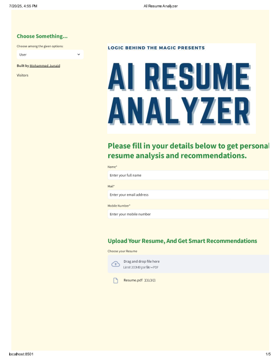
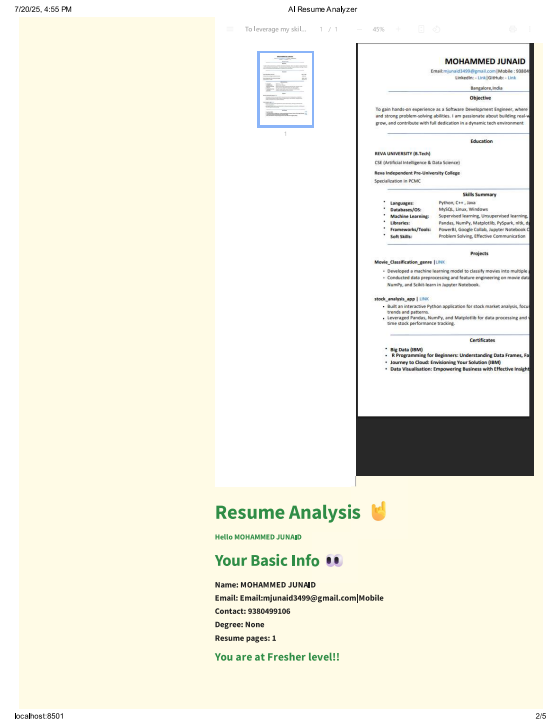
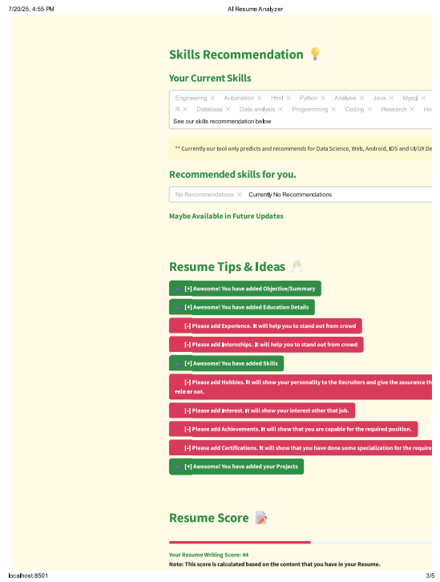
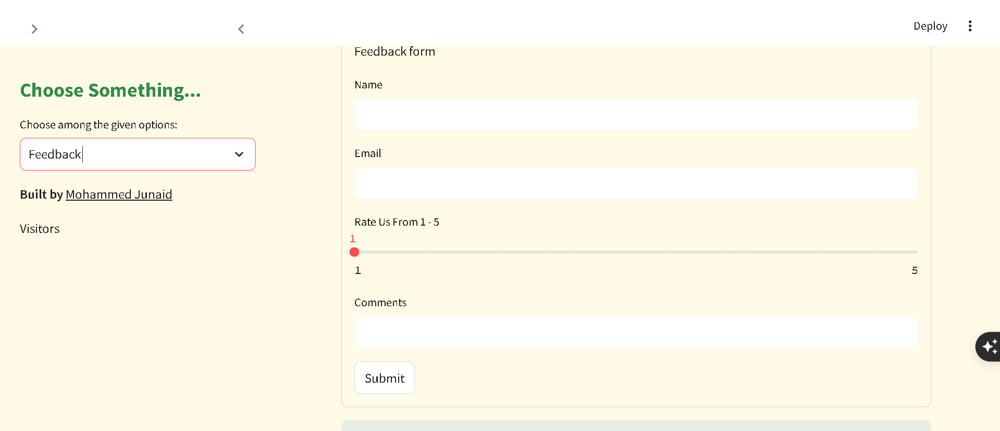
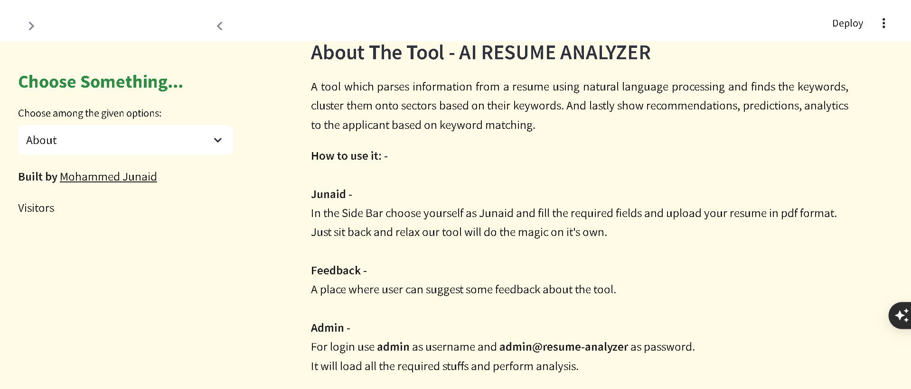
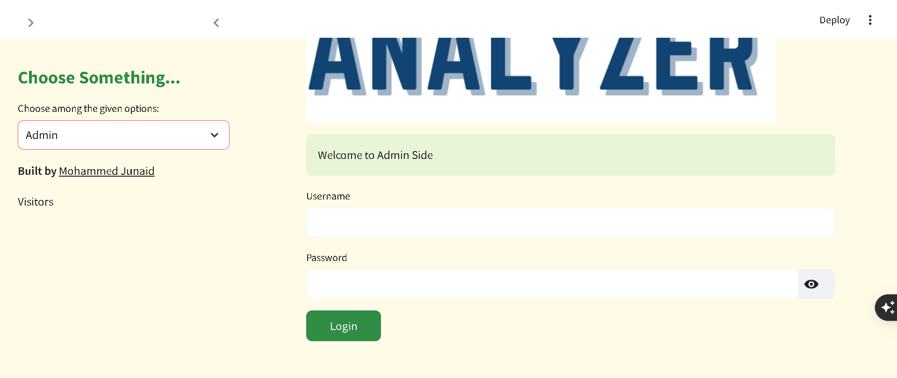
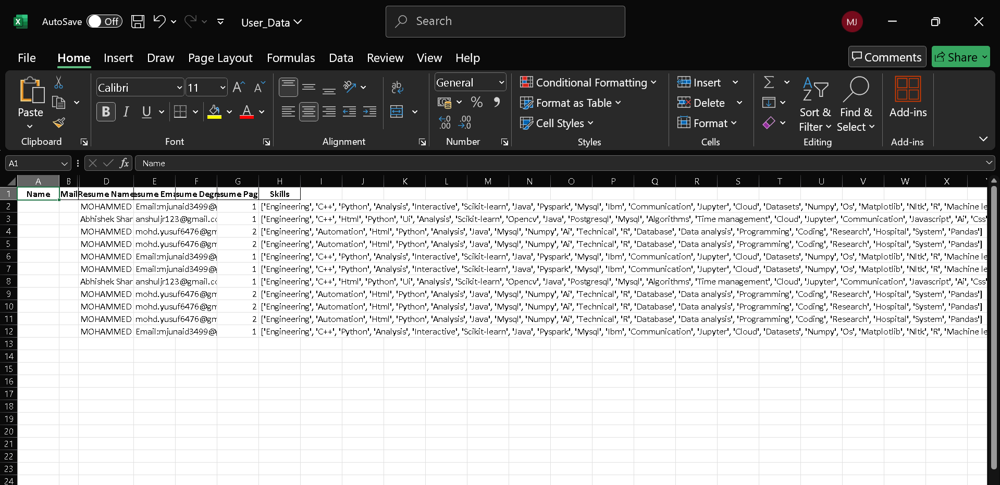

# AI Resume Analyzer

## Overview
AI Resume Analyzer is a Streamlit-based web application that allows users to upload their resumes (PDF), analyzes them using NLP, and provides personalized recommendations, skill analysis, and feedback. Admins can view analytics, and all data is saved to Excel sheets for easy access and reporting.

## Features
- Upload and analyze resumes (PDF)
- Extracts name, email, degree, skills, and more
- Provides skill recommendations and resume tips
- Feedback form for user ratings and comments
- Admin dashboard for user and feedback analytics
- All data saved to Excel (`User_Data.xlsx`) in separate sheets
- Modern, classic UI with clear, accessible design

## Technologies Used
- Python 3.8+
- Streamlit
- pandas
- openpyxl
- pyresparser (NLP resume parsing)
- plotly (charts)
- gspread/pygsheets (optional, for Google Sheets integration)

## Setup Instructions
1. **Clone the repository**
   ```bash
   git clone <repo-url>
   cd AI-Resume-Analyzer
   ```
2. **Install Python dependencies**
   ```bash
   pip install -r App/requirements.txt
   pip install openpyxl
   # For Google Sheets integration (optional):
   pip install gspread oauth2client
   ```
3. **Download spaCy model**
   ```bash
   python -m spacy download en_core_web_sm
   ```
4. **(Optional) Google Sheets Setup**
   - Follow the [gspread docs](https://gspread.readthedocs.io/en/latest/oauth2.html) to set up Google API credentials if you want to save data to Google Sheets.

## How to Run the App
```bash
streamlit run App/App.py
```
- The app will open in your browser at [http://localhost:8501](http://localhost:8501)

## Data Storage
- **Resume data** is saved to `User_Data.xlsx` in **Sheet1**
- **Feedback data** is saved to `User_Data.xlsx` in **Sheet2**
- The Excel file is created/updated automatically in your project directory
- Make sure to close the Excel file before submitting new data to avoid permission errors

## Customization
- To change the UI colors, edit the CSS blocks in `App/App.py`
- To add/remove fields saved to Excel, update the `resume_save_data` and `feedback_save_data` dictionaries
- To use Google Sheets instead of Excel, replace the `save_to_excel` function with a gspread-based function

## Screenshots

### Main UI and Upload


### Resume Preview and Basic Info


### Skills Recommendation and Resume Tips


### Bonus Video for Resume Writing Tips


### Bonus Video for Interview Tips


### Feedback Form


### About the Project


### Admin Side UI


### Excel Data Storage (Sheet1)


## Accessibility

- The app uses high-contrast colors, readable fonts, and clear icons for all status messages.
- All interactive elements (buttons, inputs, dropdowns) are clearly visible and accessible.
- All screenshots in this README include alt text for screen readers.
- For further accessibility improvements, consider:
  - Using even larger font sizes for visually impaired users
  - Testing with a screen reader
  - Ensuring all color indicators are also represented by icons or text

## Credits
- Developed by **Mohammed Junaid**
- Resume parsing powered by [pyresparser](https://github.com/OmkarPathak/pyresparser)
- UI built with [Streamlit](https://streamlit.io/)

## Known Issues / Troubleshooting

- **Excel Permission Error:**
  - If you see a 'Permission denied' error when saving to Excel, make sure the file is closed in Excel or any other program before submitting data.
- **Missing Dependencies:**
  - If you see errors about missing modules (e.g., openpyxl, pandas), install them with `pip install -r App/requirements.txt` and `pip install openpyxl`.
- **Large Excel Files:**
  - The admin dashboard paginates data for performance. If the file grows very large, consider archiving old data.
- **Resume Parsing Issues:**
  - If resume parsing fails, check that the PDF is not corrupted and is a standard, text-based PDF (not just scanned images).
- **Google Sheets Integration:**
  - Not enabled by default. See README for setup if you want to use it.

## Contributing

Contributions are welcome! To contribute:

1. **Fork the repository**
2. **Create a new branch** for your feature or bugfix
3. **Make your changes** (follow PEP8/code style)
4. **Commit and push** to your fork
5. **Open a Pull Request** describing your changes

For major changes, please open an issue first to discuss what you’d like to change.

---

## Contact
For questions, suggestions, or contributions:
- [LinkedIn: Mohammed Junaid](https://www.linkedin.com/in/mohammed-junaid-dob25042004/)
- Email: mjunaid3499@gmail.com 

## Deployment

### Local Deployment
- Run the app locally with:
  ```bash
  streamlit run App/App.py
  ```
- Make sure all dependencies are installed and Excel files are not open during use.

### Streamlit Cloud
- You can deploy this app for free on [Streamlit Cloud](https://streamlit.io/cloud):
  1. Push your code to a public GitHub repository.
  2. Go to [Streamlit Cloud](https://streamlit.io/cloud) and connect your repo.
  3. Set the main file path to `App/App.py`.
  4. Add any required secrets (for Google Sheets, etc.) in the Streamlit Cloud settings.
  5. Click Deploy!

### Other Options
- You can also deploy on Heroku, AWS, Azure, or any server that supports Python and Streamlit.
- For cloud deployment, make sure to handle file permissions and secrets securely.

--- 